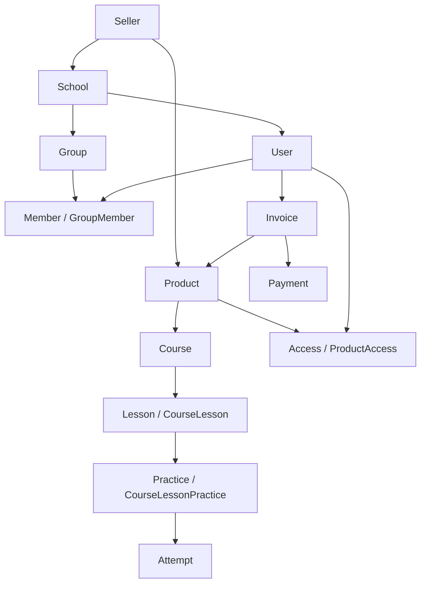

Before you integrate, it helps to understand how the Exode data model is structured and how its entities relate to each other.

## Relationship diagram

## Entities

<ResponseField name="Seller" type="">
    The business owner in Exode: a tutor, a school, a producer or a university. A seller has a balance, bank details and
    a school — one per seller. The SaaS API works only with sellers that have a school. API requests are always
    made in the context of a seller (the `Seller-Id` header holds its numeric ID, see
    ["How to get the token and IDs"](/en/exode-api/setup#how-to-get-the-token-and-ids)).
    See [`seller`](/en/exode-api/objects/entities/school#seller).
</ResponseField>

<ResponseField name="School" type="">
    The seller's learning platform with its own domain, users, courses and settings. The school context
    is set by the `School-Id` header; it must match the seller's school from `Seller-Id`.
    See [`school`](/en/exode-api/objects/entities/school).

    The **school segment** (`segment`) determines the available features: `Commerce` — a commercial online school
    (sales, invoices, payments), `Corporate` — corporate employee training (the `staff/*` org structure methods
    work only in such schools).
</ResponseField>

<ResponseField name="User" type="">
    An account in the school (a student, curator, parent, as well as service integration users). The `extId` field
    links the user to a record in your CRM/LMS: it is your own identifier — a string of up to 50 characters
    without `/` or whitespace, unique within the school. See [`user`](/en/exode-api/objects/entities/user).
</ResponseField>

<ResponseField name="Service user (API client)" type="">
    A technical school user on whose behalf the integration works. It is created together with an API key on
    the **Manage → School → For developers → API keys** page; its token is passed in `Authorization`, and its set of permissions
    is configured with checkboxes on the key page (see ["Access permissions"](/en/exode-api/permissions)).
</ResponseField>

<ResponseField name="Group and member (GroupMember)" type="">
    A group brings users together around a course/product and defines access rules and a schedule. `GroupMember` is
    the link between a user and a group. See [`group`](/en/exode-api/objects/entities/group).
</ResponseField>

<ResponseField name="Product" type="">
    A unit of sale: a course, access to the school or a digital good. A product has prices (`productPrice`) and
    discounts (`discount`). See [`product`](/en/exode-api/objects/entities/product).
</ResponseField>

<ResponseField name="Course and learning" type="">
    The product's learning course: lessons (`courseLesson`), practices (`courseLessonPractice`), attempts and
    each student's progress (`courseProgress`). See [`course`](/en/exode-api/objects/entities/course).
</ResponseField>

<ResponseField name="Access (ProductAccess)" type="">
    A user's access to a product: activity, expiration date, billing (subscription/installments). It is
    access that opens a course to a student. See [`product`](/en/exode-api/objects/entities/product).
</ResponseField>

<ResponseField name="Invoice and payment (Payment)" type="">
    An invoice records a user's purchase of products; a payment records that the invoice was paid through acquiring. See
    [`payment`](/en/exode-api/objects/entities/payment).
</ResponseField>

<ResponseField name="Forms (FormLayout) and fields (FormFieldValue)" type="">
    The seller's form layouts (questionnaires, custom fields at registration) and the field values filled in by users.
    See [`form`](/en/exode-api/objects/entities/form).
</ResponseField>

## How this relates to the API

- Every request is made in the context of a **seller** (`Seller-Id`) and a **school** (`School-Id`).
- The entities in method responses correspond to the [object reference](/en/exode-api/objects/entities/index).
- You can receive changes to these entities (registration, payment, progress, access grants) through
  [webhooks](/en/exode-api/webhooks/about).

<Tip>
    Ready for your first request? Go to the [quickstart](/en/exode-api/quickstart).
</Tip>

{/* updated-stamp */}

---

_Updated: 2026-09-25 14:33 UTC_
