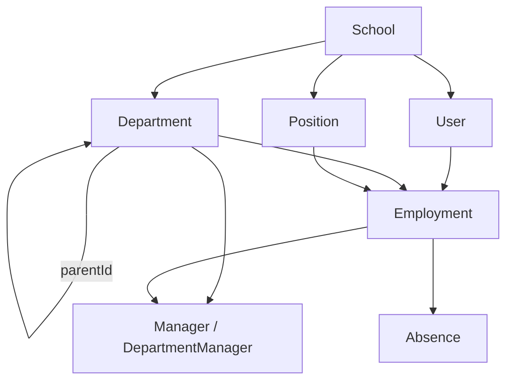

This guide describes a typical scenario for exporting employees and the org structure from an external system (1C:ZUP, a CRM,
another LMS) into Exode: the order of calls, mapping of common fields, and where to send data that has no
direct field in the API.

<Info>
  Key principle: all entities are linked through **external identifiers** (`extId`) — GUIDs or codes from your
  system. You don't need to store internal Exode IDs: departments, positions, employments, absences and
  managers are addressed by `extId` (`ext/{extId}/...` routes), users — through
  [`user/find`](/en/exode-api/school/user/find), `user/ext/{extId}/update` and
  [`user/upsert`](/en/exode-api/school/user/upsert). This is especially important for employments: on a transfer or a
  position change, the record gets a new `id`, while the `extId` is preserved.
</Info>

<Card title="1C → Exode: a ready-made sync example" icon="file-code" horizontal
      href="/en/exode-api/school/integrations/examples/1c-staff-sync">
  A complete walkthrough for 1C:ZUP: BSL code for the export loop (update by extId → NotFound → create),
  1-to-1 JSON field mapping, domains from logins, positions by GUID, and prerequisites.
</Card>

## Relationship diagram

How the entities of the staff module relate to each other:



- **Department** — a school's organizational unit; the hierarchy is built through `parentId` (`parentExtId`).
- **Employment** — the central link: user + department + position, plus the employment
  terms (`kind`, `type`, `rate`).
- **A department manager** is linked not to the user directly, but to their **active
  employment**.
- **An absence** (vacation, sick leave, business trip) is also linked to an employment.

## Sync order

<Steps>
<Step title="Departments">
  Create the org structure using the methods in the [Departments](/en/exode-api/school/staff/department) section. Pass
  `extId` (the department code from your system) and `parentExtId` for the hierarchy.

  The parent department must exist when the child is created — sync the tree
  **top-down** (or sort the export so that parents come before children).

  ```json
  { "name": "Sales department", "extId": "DEPT-001", "parentExtId": "DEPT-000" }
  ```

  On subsequent runs, call `PUT /staff/department/ext/{extId}/update` with `name` and `parentExtId` (`null` for
  root departments), and on `StaffDepartmentNotFound` — `create`. This way, renames and re-parenting in your
  system reach Exode. Note that `StaffDepartmentNotFound` is also returned when the **parent** from
  `parentExtId` is not found — so the top-down order matters for updates too.

  <Warning>
    Departments and positions must be created **before** syncing employees. If `departmentExtId` is not found
    when creating an employee, `StaffDepartmentNotFound` is returned and **the user is not created** (the same applies to
    `StaffPositionNotFound`).
  </Warning>
</Step>

<Step title="Positions">
  Create positions using the methods in the [Positions](/en/exode-api/school/staff/position) section — `name` and `extId`.
  **The correct key is the position GUID from your system (`extId`), not the name**: the name is mutable and not unique on
  your side (rename a position and name-based resolution breaks). Update the name on every
  sync through `PUT /staff/position/ext/{extId}/update`, and create the position if it doesn't exist
  (`StaffPositionNotFound` → `POST /staff/position/create`).

  <Warning>
    A position name is **unique within a school**: you cannot create two positions with the same name but different `extId`s (for example,
    from different organizations in 1C) — `StaffPositionNameIsNotUniq` is returned. Consolidate the GUIDs into one
    or don't pass the GUID for the duplicate organization.
  </Warning>

  If your positions have no codes at all (the export only has `job_position_name`), use the fallback: find
  the position by name through `GET /staff/position/list?search=...`, and create it if it doesn't exist. The `search`
  is fuzzy, so among the results pick the record whose `name` matches your value case-insensitively.
</Step>

<Step title="Employees">
  You can create a new employee with the `create` or `upsert` method (existing ones are updated with `update`). Which
  one to choose depends on your export — primarily on whether you need to set a password: see
  [Which method to use for creating an employee](#which-method-to-use-for-creating-an-employee) for details. In all cases, employments are
  passed as an array in `extra.staff.employments` (each element is `positionExtId` + `departmentExtId`,
  optionally `extId`, `type`, `kind`, `startAt`, `rate`). For a corporate school, when **creating** a user
  the array is required and must contain at least one employment (otherwise `StaffEmploymentInputRequired`).

  If an employee belongs to **several departments**, pass several elements in
  `extra.staff.employments` (from 1 to 10): the first employment with `kind: "Main"`, the rest with
  `kind: "InternalSecondary"` (or `ExternalSecondary` for external part-time work).

  <Warning>
    `extra.staff.employments` can only **"make sure the assignment exists"** (if not — hire, if yes —
    skip). It is **not a full list for syncing**: see the
    [Employments assignment behavior](#employments-assignment-behavior) section below for important details about transfers,
    terminations, and assignments missing from the array.
  </Warning>
</Step>

<Step title="Managers">
  Assign department managers with the
  [`staff/department-manager/set`](/en/exode-api/school/staff/department-manager) method: `departmentExtId` +
  `employmentExtId` (the external identifier of the manager's employment that you passed when hiring).
  The primary manager is marked with `isPrimary: true`. Pass `isPrimary` explicitly on every call: a repeated
  `set` without it turns the primary manager into a regular one. Also pass the assignment's own `extId` —
  you can use it to remove the manager through `ext/{extId}/remove` (the API has no list of managers). Only an
  employment that has already started can be assigned as manager; when the employee is terminated from it, the assignment is removed automatically.

  If your system specifies the manager for each employee (for example, `leader_external_ids`) rather than for
  the department, assign them as the department manager and/or store the manager reference in a custom field
  of the employee.
</Step>

<Step title="Other data — custom fields">
  For data that has no field in the user schema (middle name, city, tags, an arbitrary CRM status,
  an additional email), create custom fields in the [form layout](/en/exode-api/school/form-layout/create) and write the values
  through [`custom-field/value/set-by-slug`](/en/exode-api/school/custom-field/set) after upserting the user.
</Step>

<Step title="Absences">
  Create vacations, sick leaves and business trips with the
  [`staff/absence/create`](/en/exode-api/school/staff/absence) method, passing the employment's `employmentExtId` and the
  `extId` of the absence record from your system; send changes through `PUT /staff/absence/ext/{extId}/update`
  (on `StaffAbsenceNotFound` — create it). `startAt`/`finishAt` are points in time: for the absence to last
  the whole last day, pass the end of that day (`...T23:59:59`), not its start. The platform sets the `OnLeave` status
  automatically.
</Step>

<Step title="Terminations">
  On termination, call [`staff/employment/terminate`](/en/exode-api/school/staff/employment#terminate-an-employee)
  (by the employment's `extId`). Closing the **last active** employment automatically switches
  the user to the `Terminated` status and revokes their access — you don't need to block them separately. If
  the employee still has other active employments, terminating one of them is a structural change and
  access is preserved. To block access **without terminating**, pass `status: "Blocked"` to
  [`user/update`](/en/exode-api/school/user/update) — all active sessions are ended; see
  [User status lifecycle](#user-status-lifecycle).

  If your system returns the **full list** of employees (rather than changes), get the current active
  employments through [`staff/employment/list`](/en/exode-api/school/staff/employment) (`activeOnly=true`),
  compare them with the export by `extId`, and terminate the missing ones. Collect all pages of the list first and only then
  call `terminate`: terminated records drop out of the selection, and if you terminate "on the fly", pages shift —
  some records will be skipped. Exclude the user the integration runs as and the school owner
  from the comparison — they cannot be terminated from their last employment.

  `terminate` takes effect immediately, even if `finishAt` is in the future, so call it on the day of the actual
  termination.
</Step>
</Steps>

## Which method to use for creating an employee

Only `create` and `upsert` can create a new employee. User `update` **does not create** — it only
updates an existing one (and is part of the "update → NotFound → create" pattern). The choice between `create` and `upsert`
depends on whether you need to set a password.

- **`POST /user/create` — creates a new user.** If a user with the same login (`email`/`phone`/`domain`), `tgId`
  or `extId` already exists, an error is returned (`EmailIsBusy`, `PhoneIsBusy`, `DomainIsBusy`, `TgIdIsBusy`,
  `ExtIdIsBusy`). The password (`password`) is applied.
- **`PUT /user/upsert` — "create or update" in a single call.** Looks up an existing user by login / `tgId` / `extId`:
  found → updates, not found → creates. Idempotent — re-exporting the same employee neither creates a duplicate nor
  fails.
- **`PUT /user/ext/{extId}/update` (or `PUT /user/{userId}/update`) — only updates an existing user.** If
  the user doesn't exist — `NotFound` (nothing is created). This method **does not set** the password.

<Warning>
  **The password is applied only on creation** — in `create` and in the create branch of `upsert`. On **update** (including
  when `upsert` found an existing user), `password` is ignored: the `update` method doesn't
  support it.
</Warning>

**How to choose:**

- **You don't set the password** (we generate and send it on our side, or it isn't needed) → use **`upsert`**: one
  call, idempotent, the simplest option for regular syncing.
- **You set the password** (for example, a deterministic "first name + last name + year") → create new users through **`create`** (the
  password is guaranteed to apply there), and update existing ones through **`update`**. The typical pattern:
  **`update` by `extId` → on `NotFound` → `create`** (everything is addressed by `extId`, no internal Exode IDs needed).
  This won't work with `upsert`: if the user already exists, `upsert` goes to the update branch and the password you set
  won't be applied.

## Employments assignment behavior

The `employments` array in `user/create`, `user/update` and `user/upsert` is applied **idempotently** and does exactly
one thing — "hire additionally if there is no such active assignment yet". This is the key difference from a "full sync",
and it's easy to miss:

- **Repeating the same department + position pair is a safe no-op.** You can send the same assignment on every
  sync — no duplicate is created.
- **A new pair is a new assignment (part-time), not a transfer.** If the employee was transferred in 1C and you
  send a new pair in `employments`, they will have **two active assignments** (the old one and the new one), not one.
- **An assignment missing from the array ≠ termination.** If you don't send an assignment, nothing happens to it — it
  remains active. It can only be removed with an explicit `terminate`.

Therefore, HR changes for an existing employee are expressed **not through `extra`**, but through separate endpoints
in the [Employments](/en/exode-api/school/staff/employment) section:

| HR event | Endpoint |
|---|---|
| Transfer to another department | `POST /staff/employment/ext/{extId}/transfer` |
| Position change (promotion) | `POST /staff/employment/ext/{extId}/promote` |
| Both department and position changed | `transfer`, then `promote` with the same `extId` and the same `startAt` |
| Termination from an assignment | `POST /staff/employment/ext/{extId}/terminate` |
| New assignment / part-time | `POST /staff/employment/hire` (or an `employments` element) |
| Rehiring a terminated employee | `user/ext/{extId}/update` with `extra.staff.employments` (or `hire`) — the `Active` status is restored automatically |

<Info>
  Practical takeaway for incremental exports: in `user/ext/{extId}/update` for an existing employee,
  `extra.staff` is usually **not passed** — otherwise a transfer in 1C turns into an extra part-time assignment. Hiring additionally through
  `extra` is appropriate when you deliberately add another job to the employee.
</Info>

## User status lifecycle

The `user.status` field (`Active` / `OnLeave` / `Banned` / `Blocked` / `Terminated` / `Deleted`) is partially managed
automatically. `Banned`, `Blocked`, `Terminated` and `Deleted` revoke access; `Active` and `OnLeave` keep
sign-in open.

- **Termination from the last active employment** (`employment/terminate`) automatically switches the
  user to `Terminated`: sign-in is denied and all sessions are ended. **Rehiring** (`hire`) an employee with
  the `Terminated` status automatically restores `Active`. You cannot terminate yourself from your last assignment
  (`StaffCannotTerminateSelf`) or the school owner (`StaffCannotTerminateSchoolOwner`).
- **Blocking by an admin** — `user/update { "status": "Blocked" }`: sign-in is closed, sessions are ended, new
  product enrollments are prohibited; the data is kept and visible in reports. `{ "status": "Active" }` removes
  the block. The school owner cannot be blocked.
- **`Active` does not restore employment.** If you pass `{ "status": "Active" }` to a terminated
  (`Terminated`) user, sign-in opens, but they won't get an active employment. So don't
  pass `"status": "Active"` to employees terminated in Exode, and handle rehiring through a hire — the `Active`
  status is restored automatically.
- **`OnLeave` is managed by the [absences](/en/exode-api/school/staff/absence) module:** while an absence is in effect
  (vacation/sick leave), the status automatically becomes `OnLeave`, and when it ends — returns to `Active`.
  `OnLeave` is informational — **sign-in remains available**, you don't need to set it manually.
- **Ban and unban** — `user/update { "status": "Banned" }` revokes access. When the ban is lifted (pass `Active`),
  the actual status is recalculated automatically based on employments and absences: a terminated user returns to
  `Terminated`, a user on vacation — to `OnLeave`, the rest — to `Active`.

<Info>
  `OnLeave` sync also works **by calendar**: in addition to recalculation on API calls, once an hour the platform
  automatically switches employees to `OnLeave` when an absence start date arrives and returns them to `Active`
  when it ends. You no longer need to run your own periodic recalculation.
</Info>

<Info>
  Mapping the status from the export: "Employed" → `Active` (removes a previously set block). "Terminated"
  **is not passed as a status** — termination is handled through `employment/terminate`, and `Terminated` is set automatically.
</Info>

## Mapping common fields

A `user/create` or `user/upsert` request body with comments — where each field comes from and what's important to know
(`// ←` shows the source field in your export):

```jsonc
{
  "email": "smith@company.com",         // ← email. Sign-in field (login)
  "phone": "+998901234567",             // ← phone, intl. format. Sign-in field (login)
  "domain": "j.smith.01011990",         // ← your login. SIGN-IN IS DONE WITH IT. Latin letters/digits/_/dots as separators,
                                        //   ≤65, unique within the school. Cannot be digits only or look like id123
  "extId": "j.smith.01011990",          // ← GUID/external ID from your system. Sync key, NOT a login
  "password": "SecurePass123",          // ← if omitted and there is an email/phone — we generate and send it ourselves.
                                        //   Applied only on CREATION (see create vs upsert below)
  "status": "Active",                   // ← "Employed" → Active. "Terminated" — not here, but through employment/terminate
  "profile": {
    "firstName": "John",                // ← first name. ≤15 characters, letters/spaces/apostrophes
    "lastName": "Smith",                // ← last name. ≤15 characters, letters/spaces/apostrophes
                                        // ← middle name — there is NO separate field → use a custom field
    "bdate": "1990-01-01",              // ← date of birth. ISO datetime → date only YYYY-MM-DD
    "sex": "Men",                       // ← sex: "m" → Men, "f" → Women
    "role": "Student"                   // ← role: Student / Tutor / Parent
  },
  "extra": {
    "staff": {
      "employments": [                  // ← 1..10 employments (several = part-time)
        {
          "departmentExtId": "DEPT-001",                           // ← department code (create in advance)
          "positionExtId": "e3b0c442-98fc-4b39-96f7-9c2a4d001a01", // ← position GUID (create in advance). The name is not a key
          "kind": "Main",                                          // ← Main; additional — InternalSecondary/ExternalSecondary
          "startAt": "2020-03-01T00:00:00Z"                        // ← hire/assignment date (ISO 8601)
        }
      ]
    }
  }
}
```

Fields that have **no direct counterpart** in the API:

- **Middle name, city, tags, arbitrary CRM status, additional email** → [custom fields](/en/exode-api/school/custom-field/set)
  (`custom-field/value/set-by-slug` after creating/upserting the user).
- **Managers** (`leader_external_ids`) → a separate call to
  [`staff/department-manager/set`](/en/exode-api/school/staff/department-manager) (`departmentExtId` + `employmentExtId`).
- **Roles/tags with no counterpart** — are ignored.

## Limitations to know in advance

<Warning>
  - **`domain` — up to 65 characters**, Latin letters, digits and `_`; dots are allowed as segment separators
    (not at the start/end and not consecutive). Logins like `j.smith.01011990` are allowed. A domain cannot consist of digits
    only or look like `id123`. The server converts it to lowercase; the value is **unique within the school** — a taken one
    returns `DomainIsBusy`.
  - **An employee without an email or phone** can sign in only with `domain` — for them, **you must pass `password`**,
    otherwise they have no way to sign in.
  - **`firstName` and `lastName` — up to 15 characters**, letters (Latin/Cyrillic), spaces and apostrophes. Truncate long full names
    on your side.
  - **The `extId` of any entity** (user, department, position, employment, absence,
    manager) — up to 50 characters, **no `/` or spaces** (it's used in `ext/{extId}` paths); dots are
    allowed. `user.extId` is not a login.
  - **You cannot sign in with `extId` or `tgId`** — the sign-in fields are `email`, `phone`, `domain`.
  - The employments module (`staff`) is available only for **corporate schools**; for them, the
    `extra.staff.employments` array (from 1 to 10 employments) is required when creating a user.
</Warning>

## Minimal example: an employee with an employment

```bash cURL
curl --location --request PUT 'https://api.exode.biz/saas/v2/user/upsert' \
  --header 'Seller-Id: {{ sellerId }}' \
  --header 'School-Id: {{ schoolId }}' \
  --header 'Content-Type: application/json' \
  --header 'Authorization: Bearer YOUR_TOKEN' \
  --data-raw '{
    "email": "smith@company.com",
    "domain": "j.smith.01011990",
    "extId": "j.smith.01011990",
    "status": "Active",
    "profile": {
      "firstName": "John",
      "lastName": "Smith",
      "bdate": "1990-01-01",
      "sex": "Men"
    },
    "extra": {
      "staff": {
        "employments": [
          {
            "positionExtId": "manager",
            "departmentExtId": "DEPT-001",
            "kind": "Main",
            "type": "FullTime",
            "startAt": "2020-03-01T00:00:00Z"
          }
        ]
      }
    }
  }'
```

After the upsert, write non-standard attributes to custom fields:

```bash cURL
curl --location 'https://api.exode.biz/saas/v2/form/custom-field/value/set-by-slug' \
  --header 'Seller-Id: {{ sellerId }}' \
  --header 'School-Id: {{ schoolId }}' \
  --header 'Content-Type: application/json' \
  --header 'Authorization: Bearer YOUR_TOKEN' \
  --data-raw '{
    "userId": 1683,
    "layoutId": 12,
    "values": [
      { "slug": "middle_name", "value": "Robert" },
      { "slug": "city", "value": "Tashkent" },
      { "slug": "crm_status", "value": "Employed" }
    ]
  }'
```

{/* updated-stamp */}

---

_Updated: 2026-09-25 14:33 UTC_
