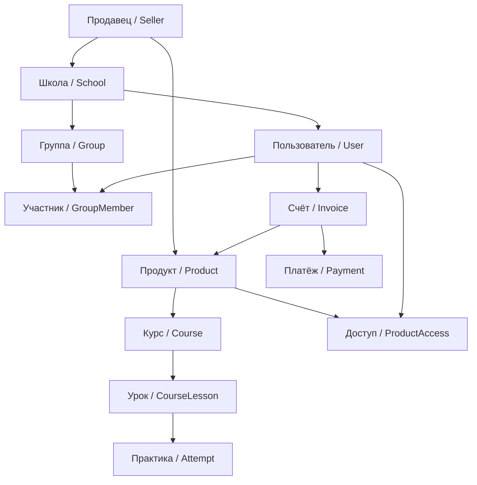

Перед интеграцией полезно понимать, как устроена модель данных Exode и как сущности связаны между собой.

## Схема связей

## Сущности

<ResponseField name="Продавец (Seller)" type="">
    Владелец бизнеса в Exode: репетитор, школа, продюсер или университет. У продавца есть баланс, реквизиты и
    одна или несколько школ. Запросы к API всегда выполняются в контексте продавца (заголовок `Seller-Id`).
</ResponseField>

<ResponseField name="Школа (School)" type="">
    Образовательная площадка продавца со своим доменом, пользователями, курсами и настройками. Контекст школы
    задаётся заголовком `School-Id`. См. [`school`](/ru/exode-api/objects/entities/school).
</ResponseField>

<ResponseField name="Пользователь (User)" type="">
    Учётная запись в школе (студент, куратор, родитель, а также сервисные пользователи-интеграции). Поле `extId`
    связывает пользователя с записью в вашей CRM/LMS. См. [`user`](/ru/exode-api/objects/entities/user).
</ResponseField>

<ResponseField name="Группа (Group) и участник (GroupMember)" type="">
    Группа объединяет пользователей вокруг курса/продукта и задаёт правила доступа и расписание. `GroupMember` —
    связь пользователя с группой. См. [`group`](/ru/exode-api/objects/entities/group).
</ResponseField>

<ResponseField name="Продукт (Product)" type="">
    Продаваемая единица: курс, доступ к школе или цифровой товар. У продукта есть цены (`productPrice`) и
    скидки (`discount`). См. [`product`](/ru/exode-api/objects/entities/product).
</ResponseField>

<ResponseField name="Курс (Course) и обучение" type="">
    Учебный курс продукта: уроки (`courseLesson`), практики (`courseLessonPractice`), попытки и прогресс
    (`courseProgress`) каждого студента. См. [`course`](/ru/exode-api/objects/entities/course).
</ResponseField>

<ResponseField name="Доступ (ProductAccess)" type="">
    Факт доступа пользователя к продукту: активность, дата истечения, биллинг (подписка/рассрочка). Именно
    доступ открывает студенту курс. См. [`product`](/ru/exode-api/objects/entities/product).
</ResponseField>

<ResponseField name="Счёт (Invoice) и платёж (Payment)" type="">
    Счёт фиксирует покупку продуктов пользователем; платёж — факт оплаты счёта через эквайринг. См.
    [`payment`](/ru/exode-api/objects/entities/payment).
</ResponseField>

<ResponseField name="Формы (FormLayout) и поля (FormFieldValue)" type="">
    Макеты форм продавца (анкеты, кастомные поля при регистрации) и значения полей, заполненные пользователями.
    См. [`form`](/ru/exode-api/objects/entities/form).
</ResponseField>

## Как это связано с API

- Каждый запрос идёт в контексте **продавца** (`Seller-Id`) и **школы** (`School-Id`).
- Сущности из ответов методов соответствуют [справочнику объектов](/ru/exode-api/objects/entities/index).
- Изменения этих сущностей (регистрация, оплата, прогресс, выдача доступа) можно получать через
  [вебхуки](/ru/exode-api/webhooks/about).

<Tip>
    Готовы к первому запросу? Перейдите к [быстрому старту](/ru/exode-api/quickstart).
</Tip>
